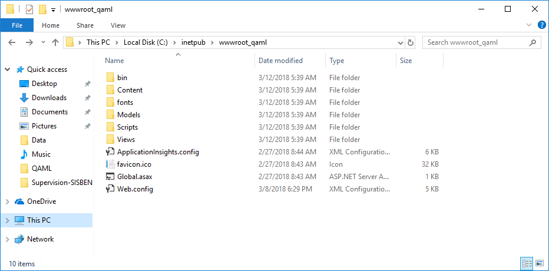
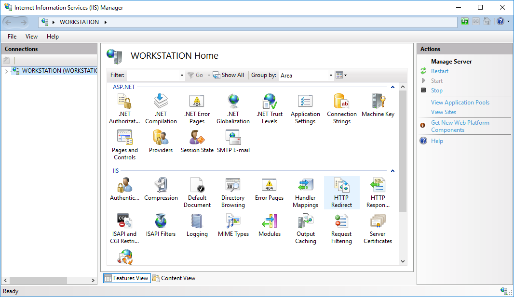
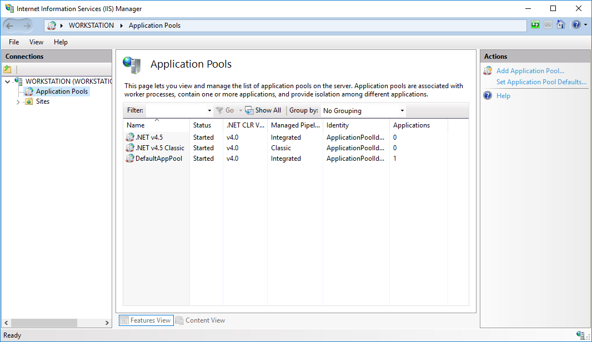
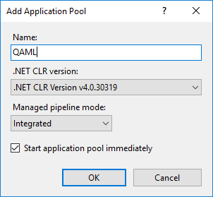
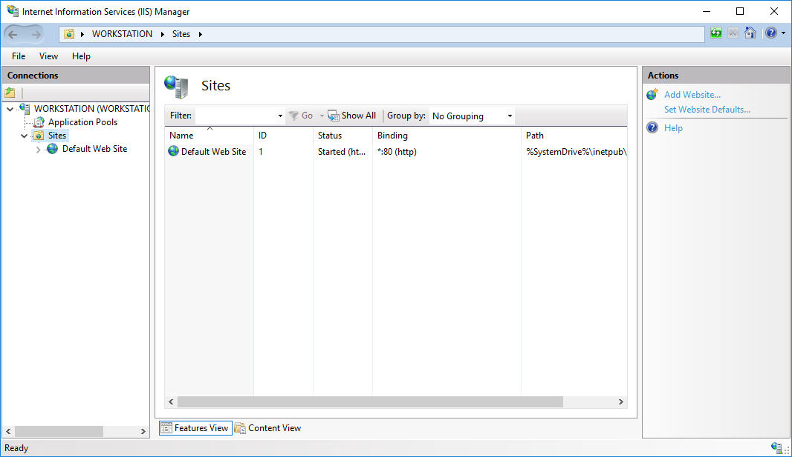
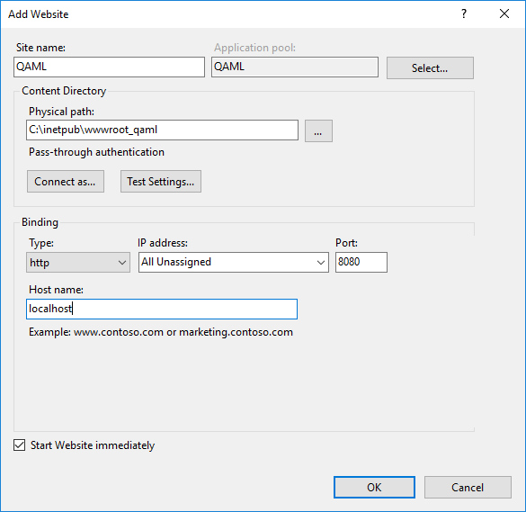
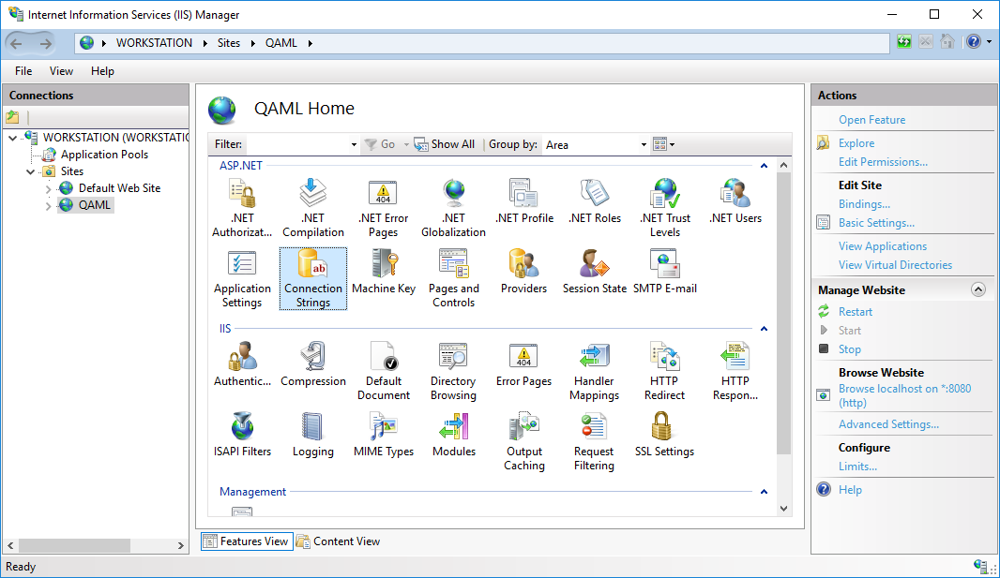
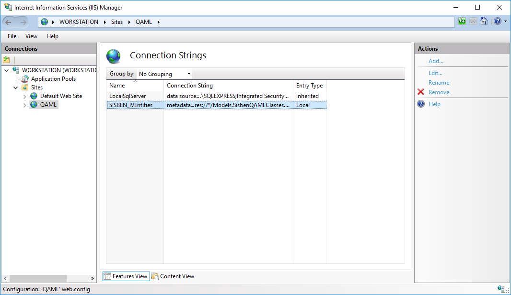
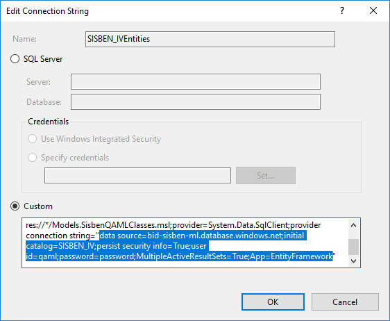
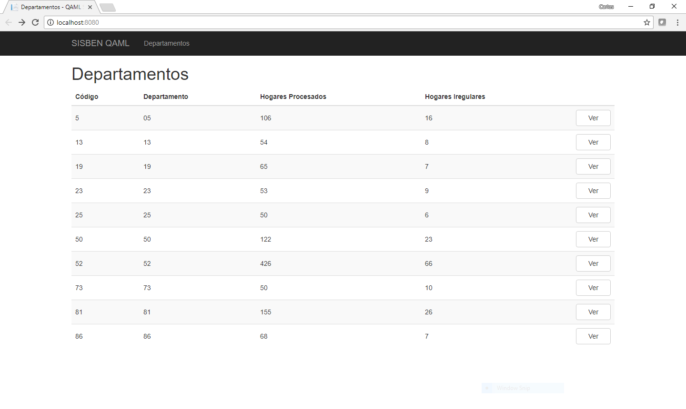

#Visualizador de Indicadores del Clasificador de Hogares SISBEN

Este documento contiene los requisitos, dependencias y procedimiento de instalación de la aplicación de visualización de indicadores del clasificador.

##Requisitos

###Hardware
---
Para poder utilizar esta aplicación el mínimo de hardware requerido es:

* Procesador: 1GHz, 1 core
* Memoria RAM: 512MiB
* HDD: 100MiB

###Software
---
Para poder instalar y utilizar esta aplicación, es necesario cumplir con los siguientes requisitos de software:

* Windows Server 2008 R2 SP1 o superior
* [Microsoft .NET Framework 4.6.1]
(https://www.microsoft.com/en-us/download/details.aspx?id=49982 ".NET Framework 4.6.1 Offline Installer") o superior
* Microsoft SQL Server 2008 R2 o superior
* Binarios de la aplicación (PublishOutput)

##Dependencias
Los paquetes de dependencias de este proyecto están definidos en el archivo [packages.config](src/Sisben.WebApps.QAML/packages.config).

##Procedimiento de instalación
Para instalar la aplicación Web para la visualización de indicadores, siga los siguientes pasos:

1. Crear directorio raíz y copiar archivos binarios
3. Crear nuevo grupo de aplicaciones (Application Pool)
4. Crear nuevo sitio Web
5. Configurar cadena de conexión (ConnectionString)
6. Probar aplicación

###Crear directorio raíz
Cree un directorio raíz donde serán colocados los binarios de la aplicación:

###Crear nuevo grupo de aplicaciones (Application Pool)
Inicie la consola de administración de IIS.

Haga clic en **Application Pools** en el panel de la izquierda.

Haga clic en **Add Application Pool...** en el panel de la derecha y llene los datos para la creación del nuevo grupo de aplicaciones.

###Crear nuevo sitio Web

Haga clic en **Sites** en el panel de la izquierda.

Haga clic en **Add Website...** en el panel de la derecha y llene los datos para la creación del nuevo sitio Web.

###Configurar cadena de conexión (ConnectionString)

Haga clic en **QAML** en el panel de la izquierda bajo el sub-menú **Sites**.

Haga doble clic en el ícono **Connection Strings**.

Haga doble clic en la cadena de conexión con el nombre **SISBEN_IVEntities** y modifique la cadena de conexión para conectarse a la base de datos con la cuenta correspondiente en su dominio.

###Probar aplicación

En un explorador de Internet entre la dirección URL de la aplicación. Al hacer esto, debe mostrarle la siguiente página:

