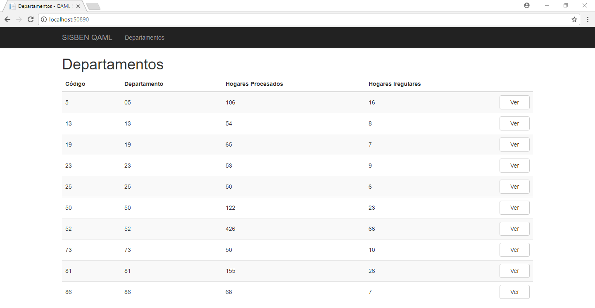
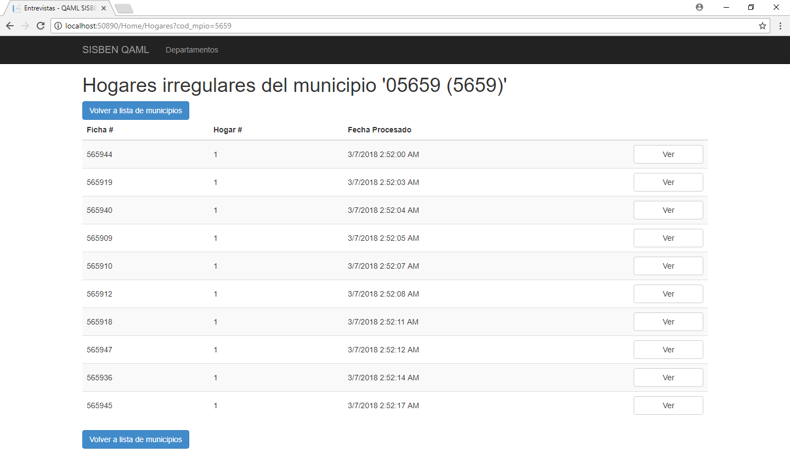
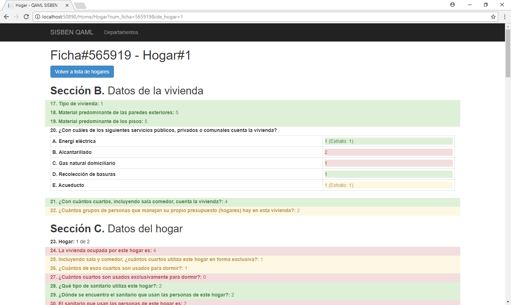
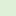
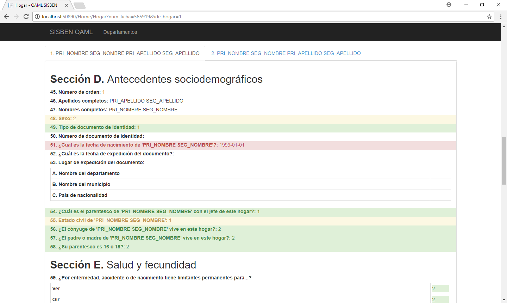

# Clasificador de datos atípicos

*Esta herramienta digital forma parte del catálogo de herramientas del **Banco Interamericano de Desarrollo**. Puedes conocer más sobre la iniciativa del BID en [code.iadb.org](code.iadb.org)*

## Descripción
Esta herramienta sirve para visualizar los indicadores de clasificación de las fichas de hogares levantados por el SISBEN en Colombia. Para conocer más sobre como funciona la clasificación, por favor diríjase al [repositorio del clasificador](https://github.com/EL-BID/Clasificador-SISBEN-ML).

Además de permitir la visualización de los indicadores de clasificación de las fichas, la herramienta permite ver en detalle los valores de las variables (y su puntaje) de las fichas de hogares clasificados como irregulares, para un análisis de los potenciales casos extraños que ocurren durante el operativo de levantamiento. Esta visualización permite la toma de decisiones para la corrección de la herramienta de captura o la generación de nuevas instrucciones para el personal de campo.

### Guía de usuario
---
Esta aplicación Web permite ver indicadores de procesamiento/clasificación por zona geográfica (departamentos y municipios).

Al iniciar, en la página principal, la aplicación muestra los indicadores por departamento como se muestra en la siguiente captura de pantalla.

Como se puede observar en la captura de pantalla anterior, podemos ver el código del departamento, nombre del departamento, cantidad de hogares procesados y la cantidad de hogares clasificados como irregulares dentro de dicho departamento.

También contamos con un botón de acción **Ver** para cada departamento. Este botón nos permite visualizar el listado de municipios del departamento en cuestión. En la siguiente captura de pantalla se muestra dicho listado:

En esta pantalla podemos observar que tenemos un listado similar al anterior, donde podemos ver el código del municipio, nombre del municipio, cantidad de hogares procesados por municipio y la cantidad de hogares clasificados como irregulares para cada municipio. También contamos con el mismo botón **Ver** que, en este caso, nos permite ver el listado de hogares irregulares para el municipio en cuestión.

El listado de hogares irregulares se ve como se muestra a continuación:

Aquí podemos observar cada uno de los hogares por su número de ficha y número de hogar dentro de la ficha. También podemos observar la fecha y hora en la cuál fue procesado por el [clasificador](https://github.com/EL-BID/Clasificador-SISBEN-ML) y un botón **Ver** que nos permite ver en detalle las variables de este hogar y la clasificación independiente de cada una de ellas.

A continuación mostramos como se ve el detalle de un hogar en particular:

 [0, 25)% de certeza
 [25, 75)% de certeza
 [75, 100]% de certeza

Los valores de certeza con los que el [clasificador](https://github.com/EL-BID/Clasificador-SISBEN-ML) marca cada variable indican el nivel de confianza que tiene el algoritmo de que dicha variable tiene una respuesta dentro de los valores esperados para la zona geográfica. Para más detalles, vea la documentación del [clasificador](https://github.com/EL-BID/Clasificador-SISBEN-ML).

Dentro de esta última vista también se pueden ver las personas miembros del hogar.

Para cambiar de persona, solo tiene que hacer clic en el nombre de la persona para la cual desea ver las variables relacionadas.

### Guía de instalación
---
Los pasos para instalar y configurar esta aplicación se muestran en el archivo [INSTALL.md](INSTALL.md).

### Cómo contribuir
---
Si deseas contribuir con este proyecto, por favor lee las siguientes guías que establece el [BID](https://www.iadb.org/es "BID"):

* [Guía para Publicar Herramientas Digitales](https://el-bid.github.io/guia-de-publicacion/ "Guía para Publicar") 
* [Guía para la Contribución de Código](https://github.com/EL-BID/Plantilla-de-repositorio/blob/master/CONTRIBUTING.md "Guía de Contribución de Código")

### Código de conducta 
---
Puedes ver el código de conducta para este proyecto en el siguiente archivo [CODE*OF*CONDUCT.md](CODEOFCONDUCT.md).

### Autor
---
Este software ha sido desarrollado por *Carlos Tejada ([carlostejada@gmail.com](mailto:carlostejada@gmail.com))* bajo el proyecto [CO-T1418](https://www.iadb.org/es/project/CO-T1418 "CO-T1418")-P001, fondos ATN/OC-16168-CO, Contrato No. 001, a través del [BID](https://www.iadb.org/es "BID") para el [DNP Colombia](https://www.dnp.gov.co/ "DNP").

### Licencia 
---
Los detalles de licencia para este código fuente se encuentran en el archivo [LICENSE.md](LICENSE.md).
