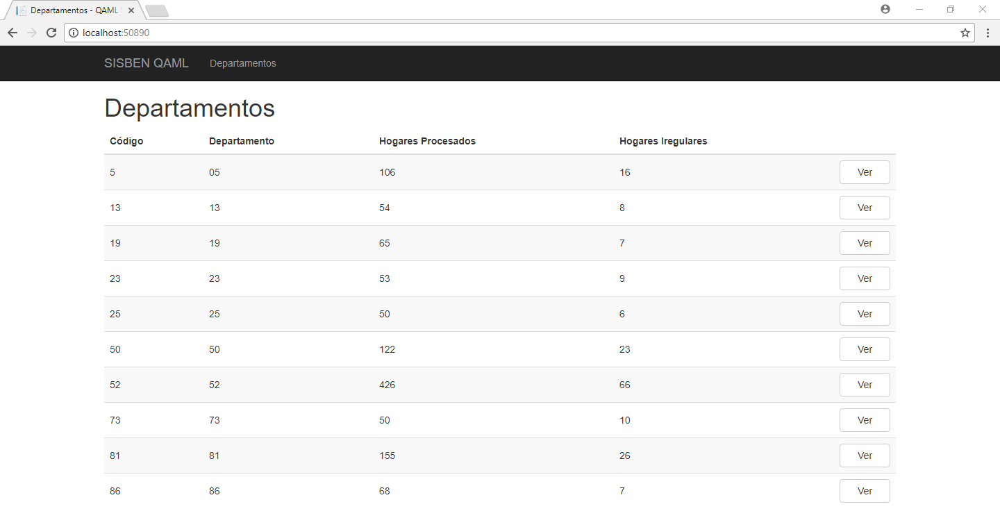
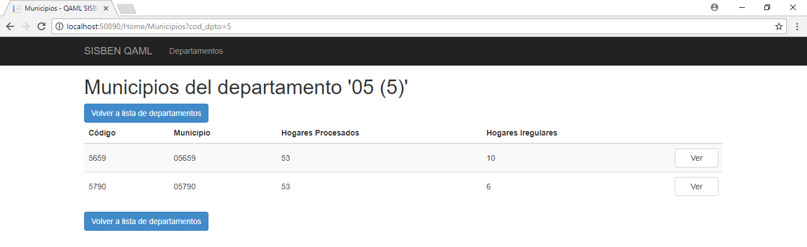
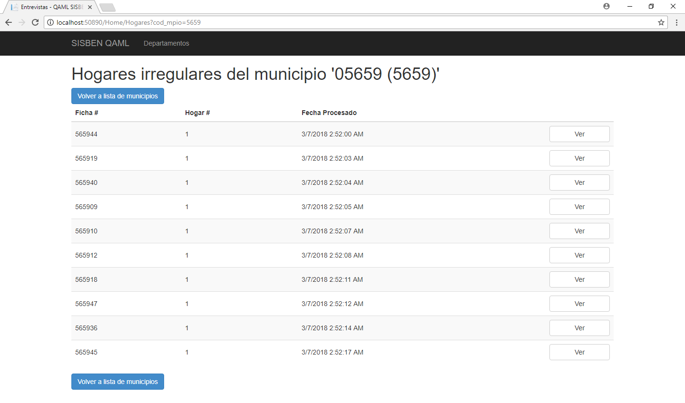
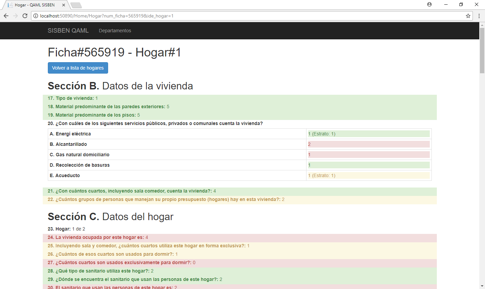
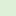
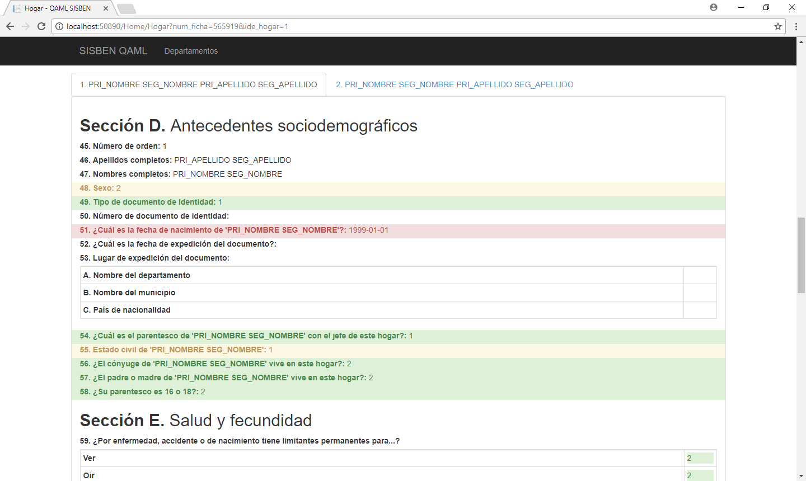

# Clasificador de datos atípicos

*Esta herramienta digital forma parte del catálogo de herramientas del **Banco Interamericano de Desarrollo**. Puedes conocer más sobre la iniciativa del BID en [https://knowledge.iadb.org/es/codigo-para-el-desarrollo](https://knowledge.iadb.org/es/codigo-para-el-desarrollo)*

## Descripción
Esta herramienta sirve para visualizar los indicadores de clasificación de las fichas de hogares levantados por el SISBEN en Colombia. Para conocer más sobre como funciona la clasificación, por favor diríjase al [repositorio del clasificador](https://github.com/EL-BID/Clasificador-SISBEN-ML).

Además de permitir la visualización de los indicadores de clasificación de las fichas, la herramienta permite ver en detalle los valores de las variables (y su puntaje) de las fichas de hogares clasificados como irregulares, para un análisis de los potenciales casos extraños que ocurren durante el operativo de levantamiento. Esta visualización permite la toma de decisiones para la corrección de la herramienta de captura o la generación de nuevas instrucciones para el personal de campo.

### Guía de usuario
---
Esta aplicación Web permite ver indicadores de procesamiento/clasificación por zona geográfica (departamentos y municipios).

Al iniciar, en la página principal, la aplicación muestra los indicadores por departamento como se muestra en la siguiente captura de pantalla.

Como se puede observar en la captura de pantalla anterior, podemos ver el código del departamento, nombre del departamento, cantidad de hogares procesados y la cantidad de hogares clasificados como irregulares dentro de dicho departamento.

También contamos con un botón de acción **Ver** para cada departamento. Este botón nos permite visualizar el listado de municipios del departamento en cuestión. En la siguiente captura de pantalla se muestra dicho listado:

En esta pantalla podemos observar que tenemos un listado similar al anterior, donde podemos ver el código del municipio, nombre del municipio, cantidad de hogares procesados por municipio y la cantidad de hogares clasificados como irregulares para cada municipio. También contamos con el mismo botón **Ver** que, en este caso, nos permite ver el listado de hogares irregulares para el municipio en cuestión.

El listado de hogares irregulares se ve como se muestra a continuación:

Aquí podemos observar cada uno de los hogares por su número de ficha y número de hogar dentro de la ficha. También podemos observar la fecha y hora en la cuál fue procesado por el [clasificador](https://github.com/EL-BID/Clasificador-SISBEN-ML) y un botón **Ver** que nos permite ver en detalle las variables de este hogar y la clasificación independiente de cada una de ellas.

A continuación mostramos como se ve el detalle de un hogar en particular:

 [0, 25)% de certeza
 [25, 75)% de certeza
 [75, 100]% de certeza

Los valores de certeza con los que el [clasificador](https://github.com/EL-BID/Clasificador-SISBEN-ML) marca cada variable indican el nivel de confianza que tiene el algoritmo de que dicha variable tiene una respuesta dentro de los valores esperados para la zona geográfica. Para más detalles, vea la documentación del [clasificador](https://github.com/EL-BID/Clasificador-SISBEN-ML).

Dentro de esta última vista también se pueden ver las personas miembros del hogar.

Para cambiar de persona, solo tiene que hacer clic en el nombre de la persona para la cual desea ver las variables relacionadas.

### Guía de instalación
---
Los pasos para instalar y configurar esta aplicación se muestran en el archivo [INSTALL.md](INSTALL.md).

### Cómo contribuir
---
Si deseas contribuir con este proyecto, por favor lee las siguientes guías que establece el [BID](https://www.iadb.org/es "BID"):

* [Guía para Publicar Herramientas Digitales](https://el-bid.github.io/guia-de-publicacion/ "Guía para Publicar") 
* [Guía para la Contribución de Código](https://github.com/EL-BID/Plantilla-de-repositorio/blob/master/CONTRIBUTING.md "Guía de Contribución de Código")

### Código de conducta 
---
Puedes ver el código de conducta para este proyecto en el siguiente archivo [CODE*OF*CONDUCT.md](CODEOFCONDUCT.md).

### Autor
---
Este software ha sido desarrollado por *Carlos Tejada ([carlostejada@gmail.com](mailto:carlostejada@gmail.com))* bajo el proyecto [CO-T1418](https://www.iadb.org/es/project/CO-T1418 "CO-T1418")-P001, fondos ATN/OC-16168-CO, Contrato No. 001, a través del [BID](https://www.iadb.org/es "BID") para el [DNP Colombia](https://www.dnp.gov.co/ "DNP").

### Licencia 
---
Los detalles de licencia para este código fuente se encuentran en el archivo [LICENSE.md](LICENSE.md).

## Acknowledgments / Reconocimientos

**Copyright © [2025]. Inter-American Development Bank ("IDB"). Authorized Use.**  
The procedures and results obtained based on the execution of this software are those programmed by the developers and do not necessarily reflect the views of the IDB, its Board of Executive Directors or the countries it represents.

**Copyright © [2025]. Banco Interamericano de Desarrollo ("BID"). Uso Autorizado.**  
Los procedimientos y resultados obtenidos con la ejecución de este software son los programados por los desarrolladores y no reflejan necesariamente las opiniones del BID, su Directorio Ejecutivo ni los países que representa.

### Support and Usage Documentation / Documentación de Soporte y Uso

**Copyright © [2025]. Inter-American Development Bank ("IDB").** The Support and Usage Documentation is licensed under the Creative Commons License CC-BY 4.0 license. The opinions expressed in the Support and Usage Documentation are those of its authors and do not necessarily reflect the opinions of the IDB, its Board of Executive Directors, or the countries it represents.

**Copyright © [2025]. Banco Interamericano de Desarrollo (BID).** La Documentación de Soporte y Uso está licenciada bajo la licencia Creative Commons CC-BY 4.0. Las opiniones expresadas en la Documentación de Soporte y Uso son las de sus autores y no reflejan necesariamente las opiniones del BID, su Directorio Ejecutivo ni los países que representa.

### AI-Powered Services Disclaimer / Exención de responsabilidad por Servicios Impulsados por IA

The Software may include features which use, are powered by, or are an artificial intelligence system (“AI-Powered Services”), and as a result, the services provided via the Software may not be completely error-free or up to date. Additionally, the User acknowledges that due to the incorporation of AI-Powered Services in the Software, the Software may not dynamically (in “real time”) retrieve information and that, consequently, the output provided to the User may not account for events, updates, or other facts that have occurred or become available after the Software was trained. Accordingly, the User acknowledges that the use of the Software, and that any actions taken or reliance on such products, are at the User’s own risk, and the User acknowledges that the User must independently verify any information provided by the Software.

El Software puede incluir funciones que utilizan, están impulsadas por o son un sistema de inteligencia artificial (“Servicios Impulsados por IA”) y, como resultado, los servicios proporcionados a través del Software pueden no estar completamente libres de errores ni actualizados. Además, el Usuario reconoce que, debido a la incorporación de Servicios Impulsados por IA en el Software, este puede no recuperar información dinámicamente (en “tiempo real”) y que, en consecuencia, la información proporcionada al Usuario puede no reflejar eventos, actualizaciones u otros hechos que hayan ocurrido o estén disponibles después del entrenamiento del Software. En consecuencia, el Usuario reconoce que el uso del Software, y que cualquier acción realizada o la confianza depositada en dichos productos, se realiza bajo su propio riesgo, y reconoce que debe verificar de forma independiente cualquier información proporcionada por el Software.
